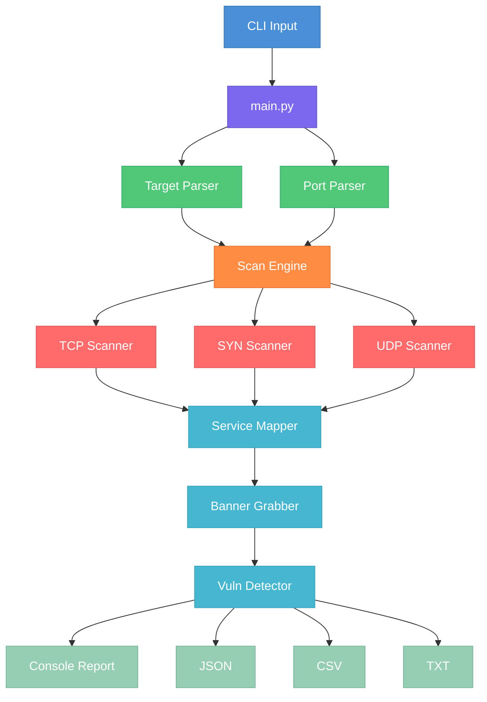

# NetProbe

**Multi-Threaded Network Port Scanner** with service detection, banner grabbing, and vulnerability flagging.


---

## Table of Contents

- [Features](#features)
- [Prerequisites](#prerequisites)
- [Installation](#installation)
- [How to Find Your Target IP](#how-to-find-your-target-ip)
- [Quick Start (Beginner)](#quick-start-beginner)
- [Understanding the Command Structure](#understanding-the-command-structure)
- [Basic Commands](#basic-commands)
- [Intermediate Commands](#intermediate-commands)
- [Advanced Commands](#advanced-commands)
- [Output & Report Commands](#output--report-commands)
- [Performance Tuning](#performance-tuning)
- [Debugging & Verbose Mode](#debugging--verbose-mode)
- [Real-World Scan Recipes](#real-world-scan-recipes)
- [CLI Reference](#cli-reference)
- [Port Specification Formats](#port-specification-formats)
- [Target Specification Formats](#target-specification-formats)
- [Sample Output](#sample-output)
- [Running Tests](#running-tests)
- [Architecture & How It Works](#architecture--how-it-works)
- [Troubleshooting](#troubleshooting)
- [Contributing](#contributing)
- [License](#license)
- [Legal Disclaimer](#legal-disclaimer)

---

## Features

- **TCP Connect scan** — full three-way handshake, works without root
- **TCP SYN scan** — half-open stealth scan (Linux + root required)
- **UDP scan** — protocol-specific payloads (DNS, SNMP, NTP, DHCP)
- **Multi-threaded** — up to 5 000 concurrent threads via `ThreadPoolExecutor`
- **Service detection** — 200+ port-to-service mappings
- **Banner grabbing** — protocol-aware (HTTP/S, SSH, FTP, SMTP, MySQL, Redis, PostgreSQL, VNC)
- **Vulnerability detection** — 34+ CVE patterns, category-based risk flags
- **Multi-format reports** — coloured console, JSON, CSV, plain-text
- **CIDR / range / hostname** — flexible target specification
- **Graceful interruption** — Ctrl+C shows partial results
- **Progress bar** — real-time ETA and completion percentage
- **macOS & Linux** compatible (SYN scan Linux-only)

---

## Prerequisites

- **Python 3.8+** — check your version:
  ```bash
  python3 --version
  ```
- **pip3** — Python package manager (usually comes with Python)
- **macOS or Linux** — the tool works on both platforms (SYN scan is Linux-only and requires root)

---

## Installation

### Step 1: Clone the project

```bash
git clone https://github.com/thesatyam161/netprobe.git
cd netprobe
```

### Step 2: Install dependencies

```bash
pip3 install -r requirements.txt
```

This installs: `colorama`, `pytest`, and `pytest-cov`.

### (Optional) Install as a system-wide package

```bash
pip3 install .
```

After this you can run `netprobe` from anywhere instead of `python3 main.py`.

---

## How to Find Your Target IP

> **New to networking?** Before you can scan a device, you need to know its IP address. Here's how to find it.

### Find Your Router's IP (Gateway)

**macOS:**
```bash
route -n get default | grep gateway
```

**Linux:**
```bash
ip route | grep default
```

> **Tip:** Most home routers use `192.168.1.1` or `192.168.0.1`.

### Find Your Own Device's IP (Local/Private IP)

**macOS:**
```bash
ipconfig getifaddr en0
```

**Linux:**
```bash
hostname -I
```

### Find Other Devices on Your Network

```bash
arp -a
```

This lists all devices connected to your local network along with their IP addresses.

### Find a Website's IP Address

```bash
nslookup example.com
```

Or use `ping`:
```bash
ping -c 1 example.com
```

> **Note:** You can also use hostnames directly — NetProbe will resolve them automatically:
> ```bash
> python3 main.py --target example.com -p 80,443
> ```

### Scan Yourself (Always Works)

If you just want to try NetProbe immediately, use **localhost**:

```bash
python3 main.py --target 127.0.0.1
```

`127.0.0.1` refers to your own machine and is always safe to scan.

---

## Quick Start (Beginner)

> **First time?** Follow these steps to run your first scan.

### Step 1: Open your terminal

### Step 2: Navigate to the NetProbe directory

```bash
cd netprobe
```

### Step 3: Run your first scan on localhost

```bash
python3 main.py --target 127.0.0.1
```

This will scan the **top 100 most common ports** on your own machine using the default settings.

### Step 4: Try scanning specific ports

```bash
python3 main.py --target 127.0.0.1 -p 22,80,443,8080
```

### Step 5: Try a scan with service detection

```bash
python3 main.py --target 127.0.0.1 -p 22,80,443 --service-detection
```

> **Congratulations!** You've just completed your first network scan. Read on for more commands.

---

## Understanding the Command Structure

Every NetProbe command follows this pattern:

```
python3 main.py --target <IP_ADDRESS> [OPTIONS]
```

| Part | Required? | Description |
|------|-----------|-------------|
| `python3 main.py` | ✅ Yes | Runs the NetProbe scanner |
| `--target <IP>` | ✅ Yes | The device/host you want to scan (replace `<IP>` with any IP or hostname) |
| `-p <ports>` | ❌ Optional | Which ports to scan (defaults to top 100) |
| `--threads <N>` | ❌ Optional | Number of threads (defaults to 1000) |
| `--timeout <sec>` | ❌ Optional | Connection timeout in seconds (defaults to 1.0) |
| Other flags | ❌ Optional | See [CLI Reference](#cli-reference) for all options |

> **Important:** Replace `<YOUR_IP>` in all examples below with your actual target IP. See [How to Find Your Target IP](#how-to-find-your-target-ip) to find it.

---

## Basic Commands

### 1. Scan Localhost (Your Own Machine)
```bash
python3 main.py --target 127.0.0.1
```

### 2. Scan Your Router
```bash
# Replace with your router's IP (usually 192.168.1.1 or 192.168.0.1)
python3 main.py --target <YOUR_ROUTER_IP>
```

### 3. Scan Specific Ports
```bash
python3 main.py --target <YOUR_IP> -p 22,80,443
```

### 4. Scan a Port Range
```bash
python3 main.py --target <YOUR_IP> -p 1-1024
```

### 5. Scan Top N Most Common Ports
```bash
# Scan top 20 most commonly open ports
python3 main.py --target <YOUR_IP> --top-ports 20

# Scan top 100 (default — same as not specifying -p at all)
python3 main.py --target <YOUR_IP>
```

### 6. Scan Specific Ports List
```bash
python3 main.py --target <YOUR_IP> -p 22,80,443,3306,8080
```

### 7. Scan a Website by Hostname
```bash
python3 main.py --target example.com -p 80,443
```

### 8. Show Help
```bash
python3 main.py --help
```

### 9. Show Version
```bash
python3 main.py --version
```

---

## Intermediate Commands

### 10. Mixed Port Specification
```bash
# Combine individual ports and ranges
python3 main.py --target <YOUR_IP> -p 22,80,443,3000-3100,8000-9000
```

### 11. Scan All 65535 Ports
```bash
python3 main.py --target <YOUR_IP> -p 1-65535 --threads 5000 --timeout 0.3
```

### 12. Enable Service Detection
Identifies what software is running on each open port:
```bash
python3 main.py --target <YOUR_IP> -p 22,80,443,3306,6379 --service-detection
# or using the short flag:
python3 main.py --target <YOUR_IP> -p 22,80,443 -sV
```

### 13. Skip Banner Grabbing (Faster Scan)
By default, NetProbe grabs banners from open ports. To disable and scan faster:
```bash
python3 main.py --target <YOUR_IP> -p 1-1024 --no-banner
```

### 14. Scan Multiple Targets (Comma-Separated)
```bash
python3 main.py --target 192.168.1.1,192.168.1.2,10.0.0.1 -p 80,443
```

### 15. Scan a CIDR Subnet (Multiple Hosts)
```bash
# Scan all 254 hosts in a /24 subnet
python3 main.py --target 192.168.1.0/24 --top-ports 20 --threads 2000
```

### 16. Scan an IP Range
```bash
# Scan 192.168.1.100 through 192.168.1.110
python3 main.py --target 192.168.1.100-110 -p 22,80,443
```

### 17. Scan Targets from a File
Create a file called `targets.txt` with one target per line:
```
# targets.txt — comments and blank lines are ignored
192.168.1.1
192.168.1.2
10.0.0.0/24
example.com
```

Then run:
```bash
python3 main.py --input-list targets.txt --top-ports 50
# or using the short flag:
python3 main.py -iL targets.txt -p 22,80,443
```

---

## Advanced Commands

### 18. TCP Connect Scan (Default, Explicit)
Full three-way TCP handshake — works on macOS and Linux, no root required:
```bash
python3 main.py --target <YOUR_IP> -p 1-1024 -sT
```

### 19. SYN Scan (Linux Only, Requires Root)
Half-open stealth scan — doesn't complete the TCP handshake (faster, stealthier):
```bash
sudo python3 main.py --target <YOUR_IP> -p 1-1024 -sS
```
> **⚠️ Note:** SYN scan **only works on Linux** with **root privileges**. On macOS, use TCP Connect scan (`-sT`) instead.

### 20. UDP Scan
Detects open UDP services (DNS, SNMP, NTP, DHCP, etc.):
```bash
python3 main.py --target <YOUR_IP> -p 53,123,161,67 -sU
```

### 21. Rate Limiting (Stealth Mode)
```bash
# Limit to 100 connections per second (stealthy, avoids detection)
python3 main.py --target <YOUR_IP> -p 1-1024 --rate-limit 100
```

### 22. Adjust Retries
```bash
# No retries (fastest, may miss filtered ports)
python3 main.py --target <YOUR_IP> -p 1-1024 --retries 0

# Extra retries for unreliable networks
python3 main.py --target <YOUR_IP> -p 1-1024 --retries 3
```

### 23. Full Reconnaissance Scan (Everything Combined)
```bash
python3 main.py --target <YOUR_IP> \
  -p 1-65535 \
  --service-detection \
  --threads 3000 \
  --timeout 0.5 \
  --output-json full_scan.json \
  --output-txt full_scan.txt
```

---

## Output & Report Commands

### 24. Save Results to JSON
```bash
python3 main.py --target <YOUR_IP> -p 1-1024 --output-json scan_results.json
# or short:
python3 main.py --target <YOUR_IP> -p 1-1024 -oJ scan_results.json
```

### 25. Save Results to CSV
```bash
python3 main.py --target <YOUR_IP> -p 80,443 --output-csv results.csv
# or short:
python3 main.py --target <YOUR_IP> -p 80,443 -oC results.csv
```

### 26. Save Results to Plain Text
```bash
python3 main.py --target <YOUR_IP> -p 1-1024 --output-txt report.txt
# or short:
python3 main.py --target <YOUR_IP> -p 1-1024 -oT report.txt
```

### 27. Save to ALL Formats at Once
```bash
python3 main.py --target <YOUR_IP> -p 1-1024 -sV \
  --output-json scan.json \
  --output-csv scan.csv \
  --output-txt scan.txt
```

### 28. Disable Coloured Output (for piping/logging)
```bash
python3 main.py --target <YOUR_IP> -p 80,443 --no-color
```

---

## Performance Tuning

### 29. Adjust Thread Count
```bash
# Use 500 threads (gentler on the network)
python3 main.py --target <YOUR_IP> -p 1-1024 --threads 500

# Use maximum 5000 threads (fast, aggressive scan)
python3 main.py --target <YOUR_IP> -p 1-65535 --threads 5000
```

### 30. Adjust Timeout
```bash
# Short timeout for local network (fast)
python3 main.py --target <YOUR_IP> -p 1-1024 --timeout 0.3

# Long timeout for remote/slow hosts
python3 main.py --target example.com -p 80,443 --timeout 3.0
```

---

## Debugging & Verbose Mode

### 31. Enable Verbose/Debug Output
```bash
python3 main.py --target 127.0.0.1 -p 80,443 --verbose
# or short:
python3 main.py --target 127.0.0.1 -p 80,443 -v
```

### 32. Verbose + No Colour (best for log files)
```bash
python3 main.py --target 127.0.0.1 -p 80,443 -v --no-color > scan.log 2>&1
```

---

## Real-World Scan Recipes

Here are ready-to-use commands for common security tasks. **Replace the target IPs with your own.**

### 🔍 Full Reconnaissance Scan
Scan all ports with service detection and save results:
```bash
python3 main.py --target <YOUR_IP> \
  -p 1-65535 \
  --service-detection \
  --threads 3000 \
  --timeout 0.5 \
  --output-json full_scan.json \
  --output-txt full_scan.txt
```

### 🌐 Web Server Discovery on a Subnet
Find all web servers on your local network:
```bash
python3 main.py --target 192.168.1.0/24 \
  -p 80,443,8080,8443,8000,8888 \
  --service-detection \
  --threads 2000
```

### 🗄️ Database Exposure Check
Check for exposed databases on your network:
```bash
python3 main.py --target 10.0.0.0/24 \
  -p 3306,5432,27017,6379,1433,9200,5984 \
  --service-detection \
  --output-csv db_exposure.csv
```

### 🔒 SSH & Remote Access Audit
Find all SSH, RDP, and VNC services:
```bash
python3 main.py --target 192.168.1.0/24 \
  -p 22,3389,5900,23,5985 \
  --service-detection \
  --output-json remote_access.json
```

### 🏠 Scan Your Own Machine (Localhost)
Quick check on your own machine's open ports:
```bash
python3 main.py --target 127.0.0.1 -p 1-10000 --timeout 0.2 --no-banner
```

### 🕵️ Stealth Scan (Low & Slow)
Scan slowly to avoid detection — good for sensitive networks:
```bash
python3 main.py --target <YOUR_IP> \
  -p 1-1024 \
  --threads 50 \
  --timeout 2 \
  --rate-limit 10 \
  --retries 2
```

### 📋 Scan Multiple Targets from File
Create `targets.txt` with your target IPs, then:
```bash
python3 main.py -iL targets.txt \
  -p 22,80,443,3306,8080 \
  --service-detection \
  --output-json network_audit.json \
  --output-csv network_audit.csv
```

---

## CLI Reference

| Flag | Short | Description | Default |
|------|-------|-------------|---------|
| `--target` | `-t` | Target host(s) — IP, CIDR, range, hostname | — |
| `--input-list` | `-iL` | Read targets from file | — |
| `--ports` | `-p` | Port specification | top 100 |
| `--top-ports` | — | Top N most common ports | — |
| `-sT` | — | TCP Connect scan | ✓ |
| `-sS` | — | TCP SYN scan (root) | — |
| `-sU` | — | UDP scan | — |
| `--threads` | `-T` | Thread count | 1000 |
| `--timeout` | — | Socket timeout (s) | 1.0 |
| `--retries` | — | Retry count | 1 |
| `--rate-limit` | — | Max connections/sec (0 = unlimited) | 0 |
| `--service-detection` | `-sV` | Enable service detection | off |
| `--no-banner` | — | Skip banner grabbing | off |
| `--output-json` | `-oJ` | JSON output file | — |
| `--output-csv` | `-oC` | CSV output file | — |
| `--output-txt` | `-oT` | Text output file | — |
| `--no-color` | — | Disable ANSI colours | off |
| `--verbose` | `-v` | Debug logging | off |
| `--version` | `-V` | Show version | — |

---

## Port Specification Formats

| Format | Example | Description |
|--------|---------|-------------|
| Single port | `-p 80` | Scan port 80 only |
| Comma list | `-p 22,80,443` | Scan these 3 ports |
| Range | `-p 1-1024` | Scan ports 1 through 1024 |
| Mixed | `-p 22,80,443,8000-9000` | Individual ports + range |
| All ports | `-p 1-65535` | Full port scan |
| Top ports | `--top-ports 50` | Top 50 most common ports |

---

## Target Specification Formats

| Format | Example | Description |
|--------|---------|-------------|
| Single IP | `--target 192.168.1.1` | Scan one host |
| CIDR | `--target 192.168.1.0/24` | Scan 254 hosts |
| IP range | `--target 192.168.1.1-254` | Scan range of last octet |
| Hostname | `--target example.com` | DNS resolution |
| Comma list | `--target 10.0.0.1,10.0.0.2` | Multiple targets |
| File | `-iL targets.txt` | One target per line |

> **Note:** The IPs shown above (like `192.168.1.1`) are **examples only**. Replace them with your actual target IP. Your IP will be different depending on your network. See [How to Find Your Target IP](#how-to-find-your-target-ip).


## Running Tests

```bash
# Run all tests with verbose output
python3 -m pytest tests/ -v

# Run a specific test file
python3 -m pytest tests/test_tcp_scanner.py -v
python3 -m pytest tests/test_port_parser.py -v
python3 -m pytest tests/test_target_parser.py -v
python3 -m pytest tests/test_banner_grabber.py -v
python3 -m pytest tests/test_report.py -v

# Run with coverage report
python3 -m pytest tests/ -v --cov=. --cov-report=term-missing
```

---

## Architecture & How It Works

### System Overview



---

## Troubleshooting

| Problem | Solution |
|---------|----------|
| `command not found: python3` | Install Python 3.8+ from [python.org](https://python.org) |
| `pip3: command not found` | Run `python3 -m pip install -r requirements.txt` instead |
| `Too many open files` | Reduce threads: `--threads 200` |
| SYN scan not working on macOS | Use `-sT` (TCP Connect) instead — SYN requires Linux + root |
| `Permission denied` for SYN scan | Run with `sudo` on Linux |
| Scan is too slow | Reduce timeout: `--timeout 0.3`, increase threads: `--threads 3000` |
| All ports show as filtered | Target may have a firewall; try `--retries 3 --timeout 2` |
| `unrecognized arguments` error | Make sure flags use double dashes with no space: `--target` not `- -target` |
| Don't know what IP to scan | See [How to Find Your Target IP](#how-to-find-your-target-ip) section above |
| Want to test safely | Scan yourself: `python3 main.py --target 127.0.0.1` |

---

## Contributing

1. Fork the repository
2. Create a feature branch (`git checkout -b feature/amazing-feature`)
3. Add tests for new functionality
4. Ensure tests pass: `python3 -m pytest tests/ -v`
5. Submit a pull request

---

## License

MIT License. See [LICENSE](LICENSE) for details.

---

## Legal Disclaimer

NetProbe is provided for **authorized security testing** and **network administration** only. Scanning networks or hosts without explicit permission is **illegal** and may violate local, state, and/or federal laws. The author assumes **no liability** for misuse. You are solely responsible for your actions.
